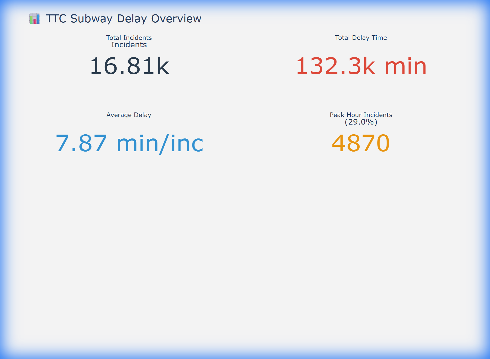
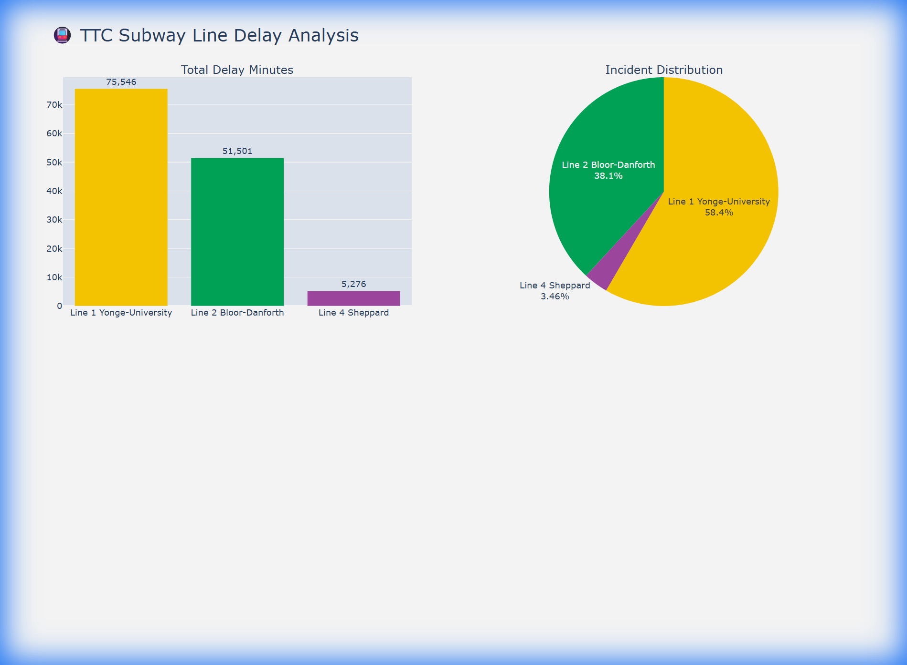
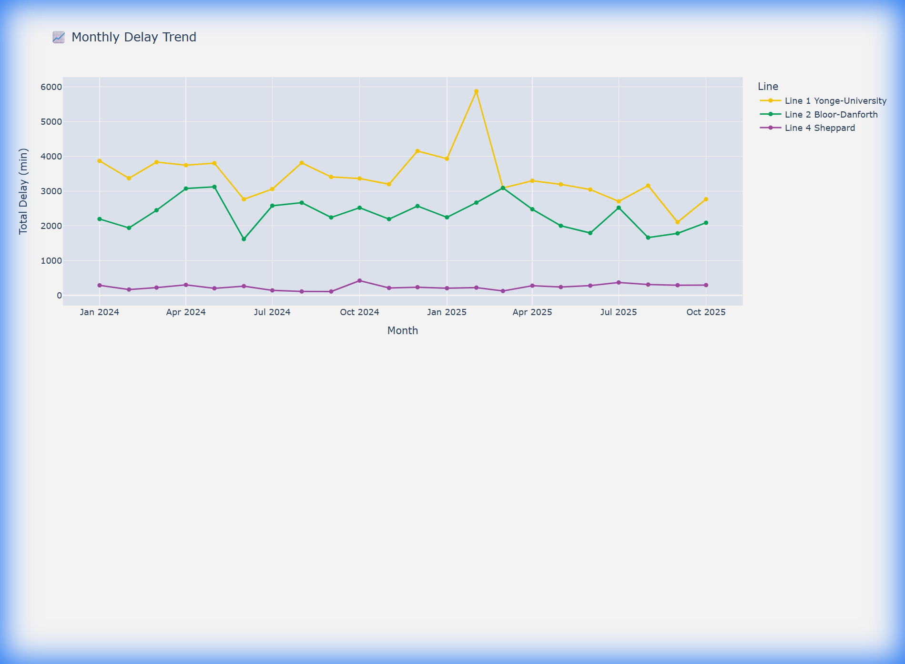
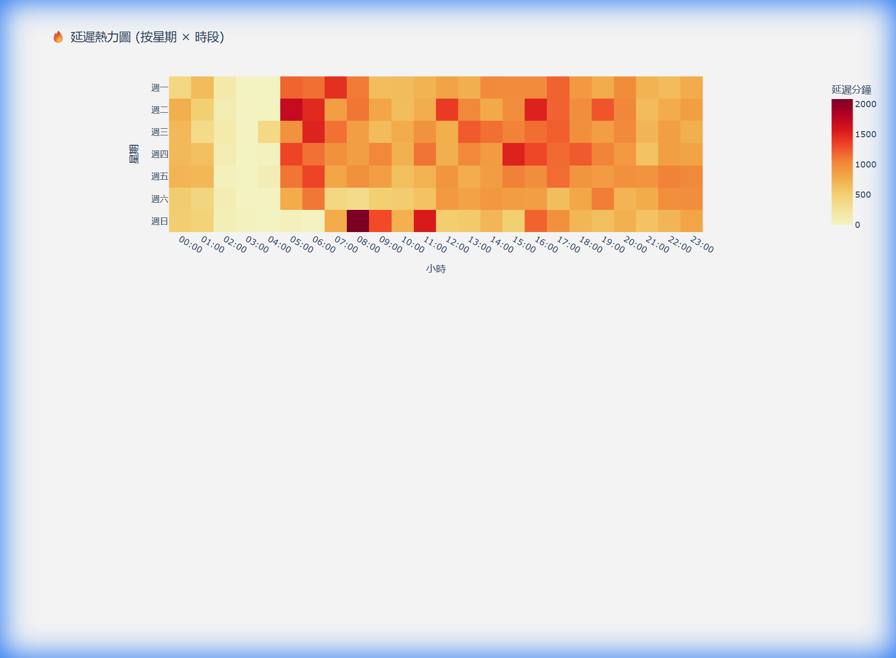
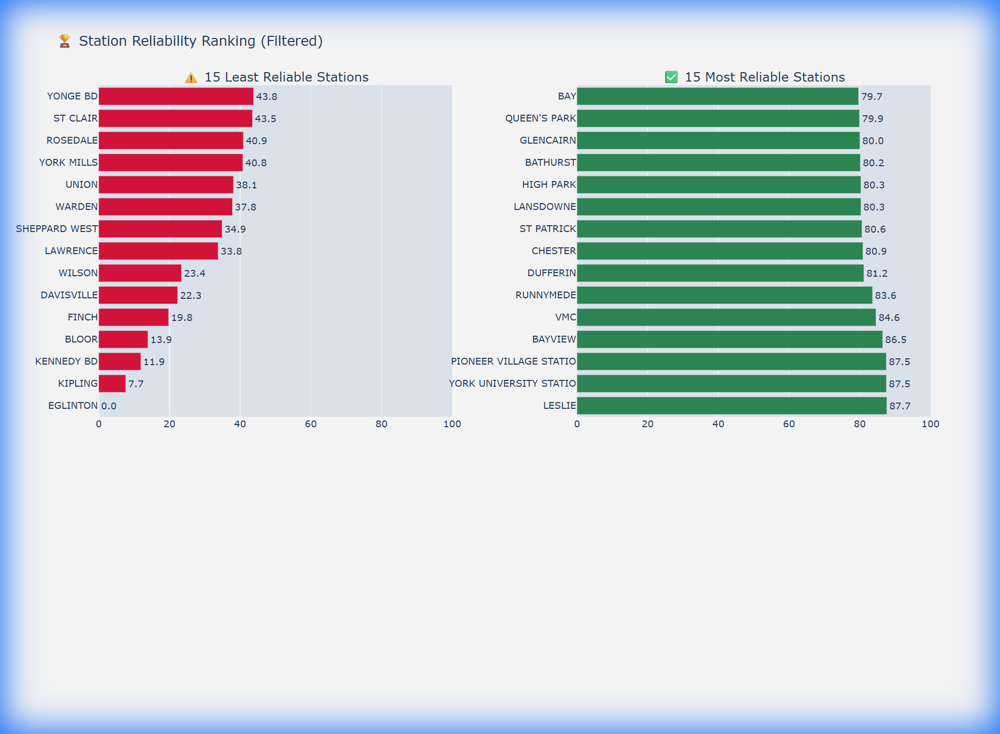
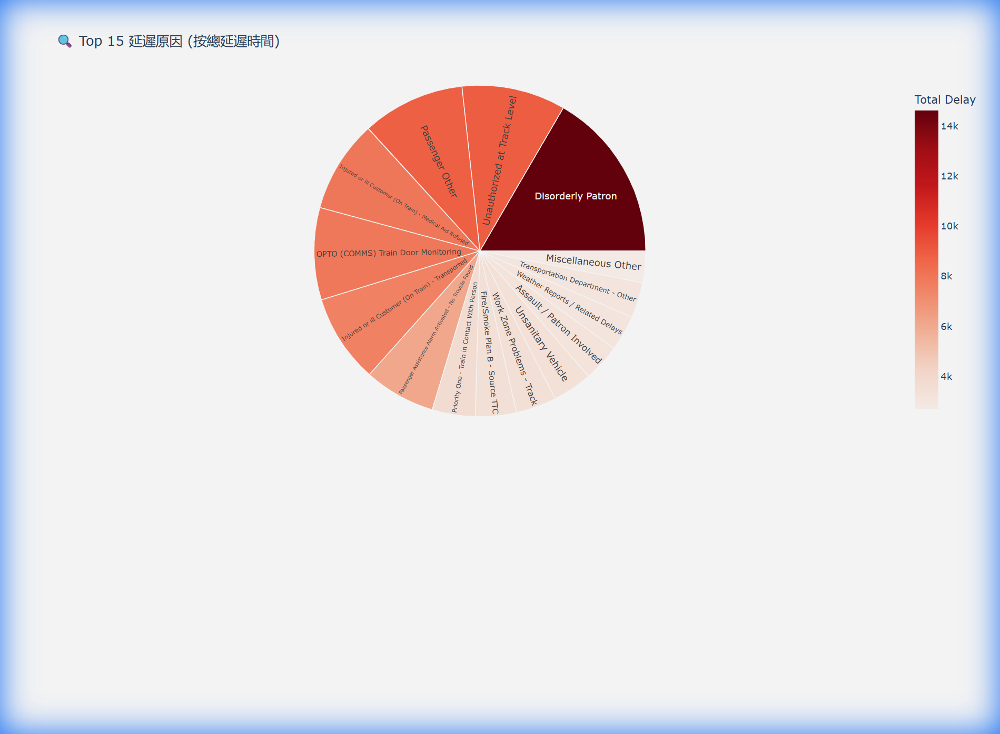

# TTC Subway Delay Data Analysis 🚇

## 📊 專案概述 (Overview)
本專案針對多倫多交通局 (TTC) 2024 年至 2025 年的地鐵延遲數據進行深度分析與清洗。透過「加權損害評分」模型，我們不僅統計延遲時間，更考量了尖峰時段對通勤族的實質影響。

## 📈 核心數據視覺化 (Key Visualizations)

### 0. 系統總覽 (System Dashboard)

> 全系統延遲概況，包含總事故次數、總延遲分鐘數及平均影響。

### 1. 路線可靠性分析 (Line Reliability)

> **分析發現**：Line 1 (YU) 承擔了全系統最多的事故壓力，而 Line 4 (Sheppard) 表現最為穩定。

### 2. 月度趨勢 (Monthly Trend)

> 追蹤延遲時間隨月份的波動，識別季節性影響。

### 3. 時段熱力圖 (Hourly Heatmap)

> **分析發現**：週一至週五的早晚尖峰時段是延遲的高發期（深紅色區域）。

### 4. 車站可靠性排行榜 (Station Reliability)

> 識別「最痛苦」與「最準點」的車站。`EGLINTON` 與 `KIPLING` 目前排名最不可靠。

### 5. 尖峰 vs 離峰對比 (Peak Analysis)

### 6. 延遲原因分析 (Root Causes)

---

## 🔍 深度分析報告 (Advanced Metrics)
我們引入了 **相對損害評分 (Relative Impact Score)** 模型：
- **尖峰時段權重 (07:00-09:00, 16:00-19:00)**：設定為 **1.5x**，反映高峰期事故對社會的更高成本。
- **可靠性分數 (Reliability Score)**：以系統中最差站點為基準 (0分)，計算各線路與車站的相對表現。

### 2024 vs 2025 趨勢觀察
根據最新數據對比：
- **事故數量**：2025 年較 2024 年下降了 **21.0%**。
- **總延遲時長**：下降了 **21.7%**。
- **平均事故損害指數**：微幅下降 **1.9%**，顯示單次事故的嚴重程度基本持平。

---

## 🛠️ 數據處理流程 (Data Pipeline)
1. **數據整合**：合併 2024 (Excel) 與 2025 (CSV) 原始資料。
2. **名稱歸一化**：自動統一車站名稱（如處理 `WARDEN STATION` 與 `WARDEN` 的差異），並修正縮寫（如 `VMC` -> `VAUGHAN METROPOLITAN CENTRE`）。
3. **數據清洗**：排除 `Min Delay = 0` 的非事故記錄，並過濾掉 `YARD`、`TAIL TRACK` 等非營運區域。
4. **自動化視覺化**：使用 Python 表格結合 Plotly 產生互動式圖表。

---

## 🚀 如何查看互動式圖表？
本專案產出的互動式 HTML 檔案位於 `charts/` 資料夾中。
您可以直接在瀏覽器中開啟這些檔案，以使用縮放、導覽及查看詳細資訊功能：
- [查看綜合儀表板](charts/00_dashboard.html)
- [查看熱力圖](charts/03_hourly_heatmap.html)

---
*最後更新時間：2025-12-26*